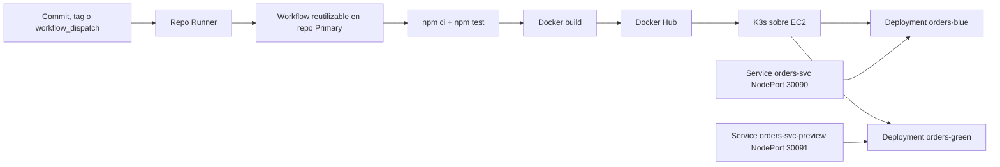
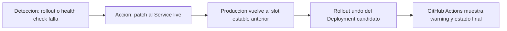

# AAU1104 - TechMarket Orders API

Repositorio de la Evaluacion Final Transversal de AUY1104. El proyecto representa el microservicio critico **Orders** de TechMarket y demuestra un pipeline CI/CD con GitHub Actions, Docker, Kubernetes K3s, despliegue **Blue-Green** y remediacion automatica.

El encargo original usa Amazon EKS y Amazon ECR como referencia. Para esta entrega se usa la infraestructura trabajada durante el semestre:

| En el encargo dice | En esta entrega se usa |
| --- | --- |
| Amazon EKS | Cluster Kubernetes K3s sobre EC2 |
| Amazon ECR | Docker Hub |
| Pipeline CI/CD | GitHub Actions con workflow reutilizable |

K3s implementa la API estandar de Kubernetes, por lo tanto los manifiestos `Deployment` y `Service`, el cambio de trafico Blue-Green y el rollback automatico se resuelven con los mismos conceptos que en EKS.

## Objetivo tecnico

El objetivo es robustecer el despliegue del servicio Orders, que antes dependia de un flujo riesgoso tipo RollingUpdate sin validaciones. La solucion implementada:

- Ejecuta pruebas automatizadas antes de construir la imagen.
- Construye y publica imagenes Docker versionadas.
- Despliega en Kubernetes con plantillas reutilizables.
- Usa Blue-Green para validar la nueva version antes de enviar trafico productivo.
- Aplica rollback automatico si falla el rollout o el health check.
- Permite cambiar namespace, nombre de aplicacion, nombre de servicio, tag de imagen y puertos sin modificar codigo fuente.

## Arquitectura



Componentes del repositorio:

| Archivo | Funcion |
| --- | --- |
| `src/index.js` | API Express y rutas HTTP |
| `src/lib/ejemplo.js` | Logica pura usada por la API |
| `tests/` | Pruebas automatizadas con Jest y Supertest |
| `Dockerfile` | Imagen productiva basada en Node 20 Alpine |
| `k8s/deployment.yaml` | Template del Deployment Blue-Green |
| `k8s/service.yaml` | Service productivo `orders-svc` |
| `k8s/service-preview.yaml` | Service de validacion previa |
| `.github/workflows/release.yaml` | Workflow cliente que llama al workflow reutilizable |

El workflow reutilizable se encuentra en el repositorio `AAU1104-OscarNeira-Primary`, archivo `.github/workflows/deploy-api.yaml`.

## API

| Metodo | Ruta | Uso |
| --- | --- | --- |
| GET | `/health` | Health check usado por probes y pipeline |
| GET | `/api/saludo?nombre=Duoc` | Respuesta JSON de saludo |
| POST | `/api/echo` | Devuelve el cuerpo JSON recibido |
| GET | `/api/suma?a=4&b=5` | Suma valores por query string |
| POST | `/api/suma` | Suma valores desde JSON |

Ejecucion local:

```bash
npm ci
npm test
npm start
```

Validacion local:

```bash
curl http://localhost:3000/health
curl "http://localhost:3000/api/suma?a=4&b=5"
```

## Pipeline CI/CD

El workflow de este repositorio esta en `.github/workflows/release.yaml` y llama a una receta reutilizable:

```yaml
uses: OscarNeira/AAU1104-OscarNeira-Primary/.github/workflows/deploy-api.yaml@main
```

El pipeline tiene tres etapas:

| Etapa | Accion |
| --- | --- |
| `deps-and-test` | Instala dependencias con `npm ci` y ejecuta `npm test` |
| `build-and-push` | Construye la imagen Docker y publica el tag versionado en Docker Hub |
| `deploy-to-k8s` | Renderiza manifiestos, despliega el slot candidato, valida salud, promueve o revierte |

Acciones externas usadas:

| Accion | Uso | Justificacion |
| --- | --- | --- |
| `actions/checkout@v4` | Descargar codigo y manifiestos | Accion oficial de GitHub con version fijada |
| `actions/setup-node@v4` | Preparar Node.js 20 y cache npm | Reduce errores de entorno y acelera pruebas |
| `docker/login-action@v3` | Autenticacion segura en Docker Hub | Evita exponer credenciales en scripts |
| `webfactory/ssh-agent@v0.9.0` | Cargar llave SSH para EC2 | Permite aplicar manifiestos en el servidor K3s |

## Variables y secretos

| Nombre | Tipo | Requerido | Descripcion |
| --- | --- | --- | --- |
| `DOCKER_USERNAME` | Secret | Si | Usuario de Docker Hub |
| `DOCKER_PASSWORD` | Secret | Si | Token o password de Docker Hub |
| `EA2_SSH_PRIVATE_KEY` | Secret | Si | Llave privada SSH para la EC2 con K3s |
| `K3S_SERVER_PUBLIC_IP` | Variable | Si | IP publica o DNS del servidor K3s |
| `K8S_NAMESPACE` | Variable | No | Namespace Kubernetes. Por defecto `orders` |

Inputs enviados al workflow reutilizable:

| Input | Valor usado |
| --- | --- |
| `image-name` | `demo-api` |
| `image-tag` | Tag indicado en `workflow_dispatch` o tag Git |
| `k8s-namespace` | `orders`, salvo que exista variable `K8S_NAMESPACE` |
| `app-name` | `orders` |
| `service-name` | `orders-svc` |

## Estrategia Blue-Green

La estrategia seleccionada es **Blue-Green**, porque Orders es un servicio critico y se busca mantener disponibilidad mientras se valida una nueva version.

El trafico productivo entra por el Service `orders-svc`:

```yaml
selector:
  app: orders
  version: blue
```

Para mover trafico, el pipeline no elimina pods productivos. Solo cambia el selector del Service:

```yaml
selector:
  app: orders
  version: green
```

Flujo automatizado:

1. El pipeline consulta el selector actual de `orders-svc`.
2. Si el Service no existe, despliega `blue` como primer ambiente.
3. Si produccion esta en `blue`, el candidato sera `green`.
4. Si produccion esta en `green`, el candidato sera `blue`.
5. Renderiza los manifiestos reemplazando `${APP_NAME}`, `${SERVICE_NAME}`, `${SLOT}` e `${IMAGE}`.
6. Aplica el Deployment candidato.
7. Aplica o actualiza el Service preview.
8. Espera `kubectl rollout status`.
9. Valida `http://127.0.0.1:30091/health` en preview.
10. Si la validacion pasa, cambia `orders-svc` al slot candidato.
11. Valida `http://127.0.0.1:30090/health` como trafico productivo.

El encargo permite controlar trafico con Service o Ingress. En esta implementacion se usa `Service` tipo `NodePort`. Un Ingress podria apuntar al mismo `orders-svc`, pero la logica Blue-Green seguiria ocurriendo en el selector del Service.

## Remediacion automatica

La remediacion se activa cuando falla cualquier paso posterior al despliegue candidato, por ejemplo:

- El Deployment no completa el rollout.
- La imagen no puede descargarse.
- El pod queda en `CrashLoopBackOff`.
- El readiness probe no pasa.
- `/health` falla en preview.
- `/health` falla despues de promover a live.

Flujo de remediacion:



La logica esta en el workflow reutilizable con `if: failure()`. En caso de fallo, se ejecuta un `kubectl patch service` para devolver `orders-svc` al slot anterior y luego se intenta `kubectl rollout undo` sobre el Deployment candidato.

Ejemplo conceptual:

```bash
kubectl -n orders patch service orders-svc --type merge \
  -p '{"spec":{"selector":{"app":"orders","version":"green"}}}'
```

Si la version candidata falla, el selector vuelve al valor estable previo. Esto reduce el MTTR porque no requiere reconstruir ni redeplegar la version anterior: basta con redirigir el Service a pods que siguen vivos.

## Comparacion de estrategias

| Estrategia | Disponibilidad | Velocidad | Costo | Rollback | Evaluacion para Orders |
| --- | --- | --- | --- | --- | --- |
| All-in-once | Baja, reemplaza todo de una vez | Alta | Bajo | Riesgoso, se debe redeplegar | No recomendable para servicio critico |
| Rolling Update | Media/alta | Media | Bajo | Puede mezclar versiones durante el cambio | Mejor que all-in-once, pero no aisla completamente el candidato |
| Canary | Alta | Media/baja | Medio | Bueno, permite retirar trafico gradual | Muy potente si hay metricas y control fino de trafico |
| Blue-Green | Alta | Alta al promover | Medio, mantiene dos ambientes | Muy rapido, cambia selector del Service | Estrategia elegida por simplicidad, aislamiento y rollback rapido |

## Impacto para TechMarket

| Factor | Impacto de la solucion |
| --- | --- |
| Disponibilidad | El servicio estable sigue activo mientras se valida la nueva version |
| Riesgo operativo | El trafico solo cambia si el health check pasa |
| Velocidad de despliegue | El cambio a produccion es un patch al Service, no una reconstruccion completa |
| MTTR | El rollback vuelve al slot anterior en segundos |
| Costo | Blue-Green usa mas recursos temporalmente porque mantiene dos versiones |
| Agilidad | El equipo puede liberar versiones con menor intervencion manual |

## Escenarios de error considerados

| Escenario | Deteccion | Respuesta |
| --- | --- | --- |
| Imagen inexistente | `rollout status` falla | Mantener o restaurar Service al slot anterior |
| Error de aplicacion | Liveness/readiness probe falla | No promover trafico |
| Endpoint `/health` con error 500 | `curl -fsS` falla | Rollback automatico |
| Latencia o timeout | `curl --max-time 5` falla | No promover o revertir |
| Manifiesto mal renderizado | Revision de variables sin resolver | Falla el pipeline antes de aplicar |
| Service con selector incorrecto | Health check live falla | Patch al Service estable |

## Como desplegar

### Opcion 1: tag Git

```bash
git tag v1.0.0
git push origin v1.0.0
```

### Opcion 2: ejecucion manual

En GitHub:

1. Ir a **Actions**.
2. Seleccionar **Release API Blue-Green**.
3. Usar **Run workflow**.
4. Indicar `image_tag`, por ejemplo `v1.0.0`.

La ejecucion manual es la recomendada para la defensa, porque permite repetir el flujo Blue-Green con tags controlados.

## Evidencias para la presentacion

La presentacion debe hacerse desde el repositorio y GitHub Actions, sin PowerPoint ni Word. Estos comandos sirven para las capturas.

### Estado inicial limpio

```bash
kubectl get pods,svc -n orders
kubectl get pods,svc -n default
```

### Primer despliegue: Blue

Despues de ejecutar el workflow por primera vez:

```bash
kubectl get pods,svc -n orders --show-labels
kubectl get svc orders-svc -n orders -o jsonpath='{.spec.selector}'; echo
curl -i http://127.0.0.1:30090/health
```

Resultado esperado:

```text
orders-blue en Running
orders-svc selector app=orders, version=blue
HTTP/1.1 200 OK
```

### Segundo despliegue: Green y promocion automatica

Ejecutar nuevamente el workflow con otro tag, por ejemplo `v1.0.1`:

```bash
kubectl get pods -n orders -L version
kubectl get svc orders-svc -n orders -o jsonpath='{.spec.selector}'; echo
curl -i http://127.0.0.1:30090/health
```

Resultado esperado:

```text
orders-blue y orders-green en Running
orders-svc selector app=orders, version=green
HTTP/1.1 200 OK
```

### Verificar que el trafico productivo esta en Green

```bash
kubectl get endpoints orders-svc -n orders -o wide
kubectl get pods -n orders -l app=orders,version=green -o wide
kubectl get pods -n orders -l app=orders,version=blue -o wide
```

Las IPs de `endpoints/orders-svc` deben coincidir con los pods `version=green`. Blue puede seguir corriendo, pero queda fuera del trafico productivo.

### Ver cambios en vivo

```bash
watch -n 2 "kubectl get pods -n orders -L version; echo; kubectl get svc orders-svc -n orders -o jsonpath='{.spec.selector}'; echo"
```

### Prueba de rollback

Para provocar un fallo controlado durante la defensa se puede romper temporalmente el readiness probe en `k8s/deployment.yaml`:

```yaml
readinessProbe:
  httpGet:
    path: /health-fail
```

Luego se ejecuta el workflow con un tag nuevo, por ejemplo `v1.0.2-bad`. El pipeline debe fallar en rollout o validacion y activar remediacion.

Validacion posterior:

```bash
kubectl get svc orders-svc -n orders -o jsonpath='{.spec.selector}'; echo
curl -i http://127.0.0.1:30090/health
```

Resultado esperado: `orders-svc` sigue apuntando al slot estable anterior y produccion responde `200 OK`.

Despues de la prueba, restaurar el probe a:

```yaml
path: /health
```

## Matriz de cumplimiento del encargo

| Requisito del PDF | Evidencia en este proyecto |
| --- | --- |
| Repositorio Git con codigo, workflows y manifiestos | Codigo Node.js, Dockerfile, `.github/workflows/release.yaml`, `k8s/` |
| Plantillas reutilizables EP1 | Workflow reusable en repo Primary llamado desde este repo |
| Build y push de imagen | Job `build-and-push` publica en Docker Hub |
| Variables dinamicas | Inputs y secrets para imagen, tag, namespace, servicio y host K3s |
| Estrategia avanzada | Blue-Green con Deployments `orders-blue` y `orders-green` |
| Control de trafico | Patch al selector del Service `orders-svc` |
| Validacion de salud | `/health` en preview y live |
| Rollback automatico | Paso `Automatic rollback on failure` con `if: failure()` |
| Prueba de fuego | Version mala con readiness probe o endpoint fallido |
| README tecnico | Este documento |
| Declaracion de IA y APA | Incluidas al final |

## Recomendaciones de commits

El PDF pide que los puntos queden documentados en commits. Se recomienda usar mensajes especificos como:

```text
Add reusable release workflow for Blue-Green deployment
Add Kubernetes manifests for orders Blue-Green services
Document automatic rollback and deployment evidence
Restore health probe after rollback test
```

## Declaracion de uso de IA

Se utilizo asistencia de IA (Claude) para la revision de errores, proponer mejoras en GitHub Actions/Kubernetes y documentacion.

## Referencias APA

Amazon Web Services. (s. f.). *What is Amazon EKS?* AWS Documentation. Recuperado el 12 de julio de 2026, de https://docs.aws.amazon.com/eks/latest/userguide/what-is-eks.html

Amazon Web Services. (s. f.). *What is Amazon Elastic Container Registry?* AWS Documentation. Recuperado el 12 de julio de 2026, de https://docs.aws.amazon.com/AmazonECR/latest/userguide/what-is-ecr.html

Docker. (s. f.). *Docker build GitHub Actions*. Docker Docs. Recuperado el 12 de julio de 2026, de https://docs.docker.com/build/ci/github-actions/

GitHub. (s. f.). *Reuse workflows*. GitHub Docs. Recuperado el 12 de julio de 2026, de https://docs.github.com/en/actions/how-tos/reuse-automations/reuse-workflows

Kubernetes. (s. f.). *Deployments*. Kubernetes Documentation. Recuperado el 12 de julio de 2026, de https://kubernetes.io/docs/concepts/workloads/controllers/deployment/

Kubernetes. (s. f.). *Service*. Kubernetes Documentation. Recuperado el 12 de julio de 2026, de https://kubernetes.io/docs/concepts/services-networking/service/

Kubernetes. (s. f.). *Configure liveness, readiness and startup probes*. Kubernetes Documentation. Recuperado el 12 de julio de 2026, de https://kubernetes.io/docs/tasks/configure-pod-container/configure-liveness-readiness-startup-probes/
